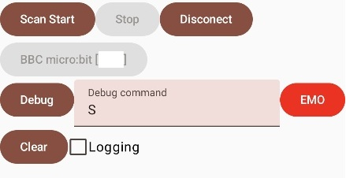

# MicrobitBleRcMq - BLE Remote Control for micro:bit and Maqueen

Copyright (c) 2025 mitsuki@engawa.org  
All rights reserved.

web: [https://mitsuki.engawa.org/](https://mitsuki.engawa.org/) 
mastodon: [@mitsuki64@fedibird.com](https://fedibird.com/@mitsuki64)

----------------
## What is this?

This app can control a micro:bit and Maqueen by Android phone with some game pad.

----------------
## How to use

1. Build this app by Android studio.
2. Install the app to your phone and allow Bluetooth permission manually.
3. Install "microbit-BleRcMq.hex" to your micro:bit.
4. Turn power on the micro:bit with Maqueen and start app on the phone.
5. Tap "Scan Start" -> "BBC Micro:bit" and use the game pad.

